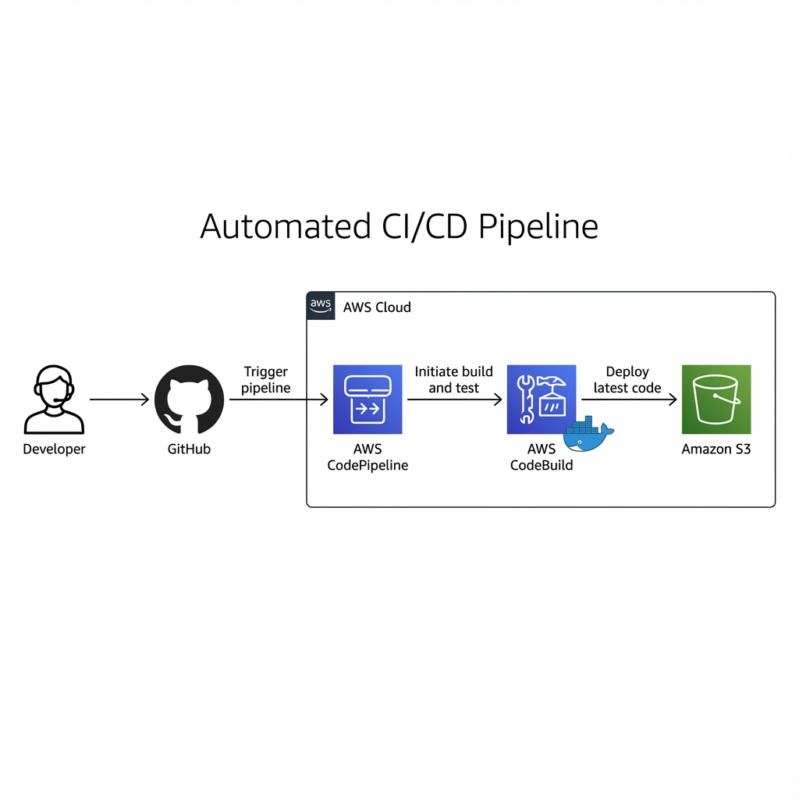

# SaaS Landing Page - Automated CI/CD Pipeline

This project demonstrates a fully automated CI/CD pipeline for a modern SaaS landing page, deploying from GitHub to Amazon S3 using AWS CodePipeline and CodeBuild.

## Key Features
- **Automated Deployment:** Zero-touch pipeline from GitHub to S3.
- **Serverless Architecture:** Cost-effective static hosting on S3.
- **Containerized Builds:** Reliable builds using Docker and AWS CodeBuild.
- **Resilient Workflow:** Uses AWS ECR Public images to avoid rate limits.

## Architecture Overview
1.  **Developer** pushes code to GitHub.
2.  **AWS CodePipeline** triggers the build process.
3.  **AWS CodeBuild** executes the build inside a **Docker container**.
    *   Pulls base images from **AWS ECR Public** to ensuring reliability.
4.  Build artifacts (static files) are extracted and deployed to **Amazon S3**.
5.  The website is globally available via S3 Static Website Hosting.
